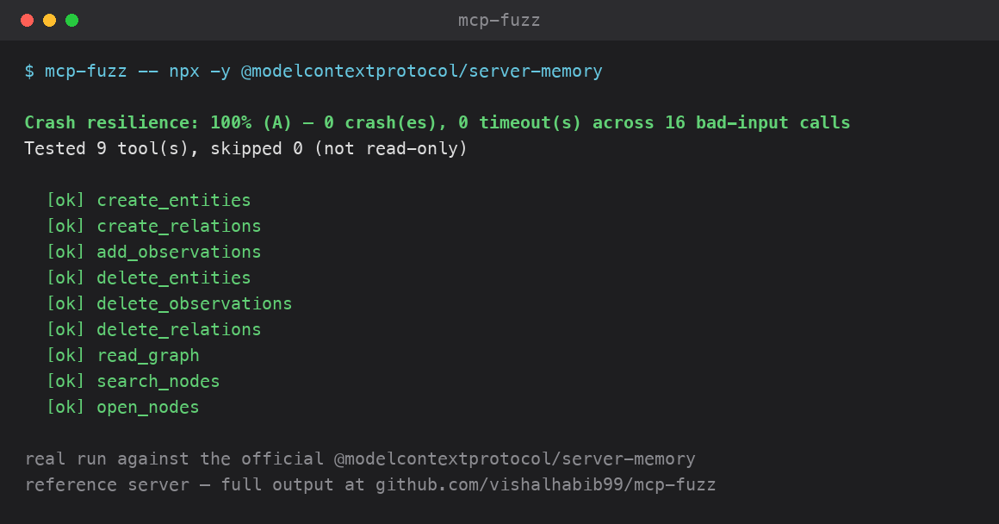

# mcp-fuzz

Runtime behavioral testing for [MCP](https://modelcontextprotocol.io) servers.



*Real output from a live `--include-destructive` run against the official [`@modelcontextprotocol/server-memory`](https://github.com/modelcontextprotocol/servers/tree/main/src/memory) reference server — not a synthetic example.*

[`mcp-doctor`](https://github.com/vishalhabib99/mcp-doctor) reads an MCP server's *source code* and checks whether its tools are well-documented. `mcp-fuzz` does the opposite: it actually **launches the server and calls its tools**, with inputs derived from each tool's own declared JSON schema, and checks whether the server behaves the way that schema and its description claim — does a missing required field get a structured error back, or does the server crash? Does a wrong-typed field get rejected cleanly, or does it hang?

Static analysis can't see any of that. Only running the code can. It also measures things static analysis structurally can't: how long each tool actually takes to respond ([Latency check](#latency-check)), how large its response actually is ([Response size check](#response-size-check)) and what that adds up to across a whole session ([Token cost estimate](#token-cost-estimate)), whether it behaves correctly when several callers hit it at once ([Concurrency check](#concurrency-check--opt-in)), whether a resource actually stays deleted once a tool says it deleted it ([Resource lifecycle check](#resource-lifecycle-check--opt-in-chains-a-real-id)), and whether deleting one resource leaves another that referenced it orphaned ([Cross-resource lifecycle check](#cross-resource-lifecycle-check--opt-in-parentchild-workflows)) — all opt-in except latency, response size, and token cost, which need no flag.

It still deliberately stops short of judging whether a *successful* call's response is actually correct — a schema-only placeholder value usually isn't realistic enough to fairly judge that. [`mcp-reality-check`](https://github.com/vishalhabib99/mcp-reality-check) is the third tool in the family that picks up exactly that: does it fail safely, and does it actually work.

## Install

```bash
pip install mcp-runtime-check
```

(The PyPI *distribution* name is `mcp-runtime-check` — `mcp-fuzz` and close variants were blocked by PyPI's anti-typosquat check as too similar to existing packages, same naming friction mcp-doctor hit. The installed CLI command is still `mcp-fuzz`, and the repo/import package are unchanged.)

## Use

```bash
mcp-fuzz -- python server.py
mcp-fuzz -- npx -y some-mcp-server
```

`mcp-fuzz` launches the command you give it as an MCP server over stdio, lists its tools, and for each one runs three kinds of calls built purely from that tool's own `inputSchema` — no LLM, no network calls of its own:

- **valid** — one plausible value per property (respecting `type`, `enum`, `minimum`/`maximum`, `format`, ...) — should succeed.
- **missing required** — the valid call, with one required property removed at a time — should come back as a structured MCP error, not a crash.
- **wrong type** — the valid call, with one property swapped to a value of a different JSON type — same expectation.

Any call that crashes the server, hangs past `--timeout` (default 15s), or leaves the connection unusable triggers a full reconnect before the next case runs, so one bad tool doesn't invalidate the rest of the report.

By default, only a minimal, safe set of environment variables (`PATH`, `HOME`, ...) is passed to the target server — never your full shell environment. Many real servers need an API key to start at all; pass one through explicitly rather than relying on the ambient environment:

```bash
mcp-fuzz --env BRAVE_API_KEY=... -- npx -y @brave/brave-search-mcp-server
```

## Remote servers (Streamable HTTP)

Pass `--url` instead of `-- <command>` to connect to an already-running server over Streamable HTTP rather than launching a local stdio one — increasingly how a hosted/SaaS MCP server actually ships:

```bash
mcp-fuzz --url https://example.com/mcp --header "Authorization=Bearer $TOKEN"
```

`--header` is the `--url` equivalent of `--env` — repeatable, `KEY=VALUE`. The two transports are mutually exclusive (pass one or the other, not both), and everything else — crash resilience, latency, response size, concurrency, `--sequential` — works identically either way.

One real difference in blast radius: over stdio, mcp-fuzz owns the launched subprocess, so a tool that crashes the server (`kills_process`-style) is almost always recoverable with a relaunch. Over `--url`, mcp-fuzz doesn't own the remote process and has no way to relaunch it — if a tool takes the server down for good, the run reports `terminated_early` with the tool that did it, marks every tool after it as skipped (`"server became unreachable mid-run"`), and returns the partial results gathered before that point rather than crashing mcp-fuzz's own run with an unhandled connection error.

## Safety — read this before pointing it at anything real

`mcp-fuzz` actually **executes** tool calls. Unlike mcp-doctor, it has real side effects if a tool does. By default, **only tools annotated `readOnlyHint: true` are tested** — everything else is skipped and listed as such in the report. Pass `--include-destructive` to test everything, but only against a server you're confident is safe to call blindly (a local sandbox, a test/staging backend) — never a server wired to production data, a real inbox, a real payment system, etc. Many real-world servers don't set `readOnlyHint` accurately or at all, in which case those tools are conservatively skipped rather than assumed safe.

## What the score means

The reported "crash resilience" percentage covers only the **missing-required** and **wrong-type** cases — the fraction that came back as a structured error instead of a crash or hang. It does **not** grade whether the tool's "valid" call produced a *correct* result: a synthetic, schema-only-derived value (a placeholder string where the field really expects a real arXiv ID, or a URL that has to actually resolve) often isn't realistic enough for a failure there to be a fair judgment. A failed "valid" call is reported separately, flagged explicitly as **"may be a synthetic-input false positive, not a confirmed bug"** — worth a manual look, not proof of a bug.

## JSON output / CI

```bash
mcp-fuzz --json -- python server.py
mcp-fuzz --fail-under 90 -- python server.py   # non-zero exit if crash resilience < 90%
```

Want this alongside mcp-doctor's static checks and mcp-reality-check's output-fidelity checks in one PR comment instead of three? [`mcp-trust-check`](https://github.com/vishalhabib99/mcp-trust-check) is a single GitHub Action that runs all three and posts one combined score.

## Latency check

Every call was always timed internally (see Full-fidelity trace export below) — this surfaces that timing as a real, scored part of the report instead of leaving it buried in an opt-in export. For each tested tool's **valid** call (the one call that does real work, unlike a bad-input call that's typically rejected before any real work happens), mcp-fuzz flags a tool as slow when either is true:

- it takes longer than an absolute threshold (default 5000ms, override with `--slow-threshold-ms`), or
- it's a clear outlier relative to this same server's other tools — more than 3x the server's own median **and** over 100ms (only checked once there are at least 3 comparably-tested tools; calling one thing an "outlier" against a sample of one or two isn't a fair comparison). The 100ms floor exists because on a fast server the ratio alone flags noise: before it was added, a 2.7ms `echo` on the reference `server-everything` counted as "slow" for being 3.1x a 0.9ms median, and 8 of 10 latency flags across a 10-server run were sub-25ms calls like that.

A tool whose valid call crashed or timed out is excluded from the latency check entirely, not counted as merely "slow" — that failure is already the crash-resilience score's job to report, and its duration is contaminated by reconnect/timeout overhead rather than real service time anyway.

```bash
mcp-fuzz --slow-threshold-ms 3000 -- python server.py
mcp-fuzz --fail-under-latency 90 -- python server.py
```

**Read this before treating the latency score as more precise than it is**: this is one real call per tool, not a load test — no repeated sampling, no percentiles, no warm-up run. It's a cheap, real signal worth a manual look (a single wildly slow tool among fast siblings usually does mean something real — an unbounded upstream call, a missing timeout, an N+1 query), not a benchmark you'd cite as a tool's actual production latency.

## Response size check

Same two-signal design as latency, applied to response size instead of response time: a tool that dumps an unusually large payload burns an agent's context window for no reason an agent can see coming from the tool's own description. For each tested tool's **valid** call, mcp-fuzz flags a tool as bloated when either is true:

- its response is longer than an absolute threshold (default 20,000 characters, roughly 5,000 tokens on the common ~4-chars/token rule of thumb for English text — a cheap estimate stated as such, not real tokenization; override with `--bloat-threshold-chars`), or
- it's a clear outlier relative to this same server's other tools — more than 3x the server's own median response length **and** over 1,000 characters (~250 est. tokens) (same minimum-sample-size guard and same reasoning for the floor as latency).

Same crash/timeout exclusion as latency, for the same reason: no real response to measure the size of.

```bash
mcp-fuzz --bloat-threshold-chars 10000 -- python server.py
mcp-fuzz --fail-under-response-size 90 -- python server.py
```

**Same caveat as latency**: one real call per tool, not representative of every possible input a tool could return. A tool genuinely designed to return a lot of content (a full-file read, a config dump) isn't a bug just because it's large relative to its neighbors — this is a "worth a look" signal, not a confirmed problem.

## Token cost estimate

The response size check above flags individual outliers; this rolls the same ~4-chars/token estimate up into one whole-session number — a rough answer to "what would it cost an agent's context window to call every tested tool here once." Always computed, no flag needed: it's a pure rollup of data the response size check already gathers, not a new call against the server.

```
Estimated token cost: ~5,412 tokens total across 12 tool(s) (~451 avg/call) — one call per tool, ~4 chars/token rule of thumb, not a real tokenizer
```

**Tokens by default, never dollars — unless you explicitly ask.** A real dollar figure depends on which model is actually consuming the response and that model's current per-token pricing, neither of which this tool can know on its own, and a guessed number presented as a cost is worse than no number at all. Pass `--price-model <name>` to opt in to a dollar estimate against a small, fixed list of currently-supported models:

```
mcp-fuzz --price-model claude-sonnet-5 -- python server.py
```
```
Estimated token cost: ~5,412 tokens total across 12 tool(s) (~451 avg/call) — one call per tool, ~4 chars/token rule of thumb (~$0.0108 at claude-sonnet-5's list input price — not a real tokenizer, no caching/volume discount — see README)
```

An unrecognized model name is a clean CLI error listing the supported names — never a silent guess or a fallback to some other model's price. Supported models and Anthropic's first-party list **input** price per 1M tokens (checked 2026-09-21 — a tool's response becomes *input* tokens for whichever model reads it on the agent's next turn, so this prices against the input rate, not output):

| Model | Input $/1M tokens |
|---|---|
| `claude-opus-5` | $5.00 |
| `claude-sonnet-5` | $2.00 |
| `claude-haiku-4-5` | $1.00 |

Deliberately narrow and static rather than trying to track every provider's pricing (which drifts constantly and this tool has no reliable way to keep current): Anthropic first-party API rates only, no caching discount, no volume discount, no Bedrock/Vertex AI/Microsoft Foundry rates (those platforms set their own). Same crash/timeout exclusion as latency and response size: a call with no real response has nothing to count.

## Runtime gate — the same two checks, live during a real agent session

Everything above runs once, offline: one synthetic-but-realistic call per tool, scored in a batch report. `LatencyGate` applies the identical two-signal design (absolute threshold + relative outlier) to real calls an agent makes during a live session — with one real design difference, not just a mechanical port: a one-shot audit only ever has one call per tool to compare against its *siblings* on the same server, but a live session can call the same tool many times, so `LatencyGate` tracks each tool's own call history and flags a call that's unusual **for that tool**, not relative to unrelated tools it happens to share a server with.

```python
from mcp_fuzz.gate import LatencyGate

gate = LatencyGate()  # one instance per session — history accumulates across calls

# in place of a bare `await session.call_tool(tool_name, arguments)`:
result = await gate.timed_call(session, tool_name, arguments)

if result.outcome != "ok":
    ...  # crashed or timed out
elif result.flagged:
    ...  # unusually slow or large for this tool, given what it's done before
```

Verified against a real crash and a real timeout (the fixture server's `kills_process`/`hangs_forever` tools, not mocked), and dogfooded live against the official `@modelcontextprotocol/server-memory` reference server — real `create_entities`/`read_graph` calls, both correctly unflagged. Same companion as [`mcp_reality_check.gate`](https://github.com/vishalhabib99/mcp-reality-check#runtime-gate--use-it-live-not-just-as-a-batch-audit): correctness there, latency/size here — compose both in the same call site if you want both.

## Concurrency check — opt-in

Everything above calls one tool at a time. This is the one check that doesn't: with `--concurrency N`, for each tested tool, mcp-fuzz also launches `N` **independent connections** — each its own subprocess of the target server command — and calls the tool with the same valid arguments on all of them at once. Independent connections, not N calls fanned out over one shared session, deliberately: it's a real test of concurrent access to whatever backend the server itself talks to (a shared file, database, lock, rate limiter), the kind of bug that N sequential calls on one connection structurally can't surface.

```bash
mcp-fuzz --concurrency 5 -- python server.py
mcp-fuzz --fail-under-concurrency 90 -- python server.py
```

Off by default — it means `N` extra subprocess launches per tool, real cost for a real server. A tool is flagged only when the concurrent failure is actually informative:

- **some concurrent calls succeeded and others didn't**, on the identical input — proof the failure is load-dependent, not just unrealistic synthetic data (the same argument this tool's own README elsewhere applies leniently to a *lone* valid-call error doesn't apply here, since the same data demonstrably worked for at least one other concurrent caller), or
- **the tool's own sequential call succeeds fine, but it fails under concurrent load** — the sharper signal of the two, since it usually means a deadlock or resource-starvation bug rather than a tool that's simply broken.

A tool whose sequential call *also* already fails, failing the exact same way on every one of the N concurrent calls too, is deliberately **not** re-flagged here — that's not new information, just the same already-known brokenness (already surfaced by the crash-resilience score) showing up again.

Note on how a failure actually shows up: an application-level exception raised inside a tool handler is commonly caught by the server's own framework (FastMCP, for one, verified directly) and returned as a normal `isError: true` response, not a raw crash — this check treats that the same as a crash/timeout when it happens under concurrent load, since excluding it would silently miss most real concurrency bugs.

## Resource lifecycle check — opt-in, chains a real id

Everything above tests one tool call in isolation, always with synthetic, schema-derived arguments — even a `get_item`-shaped tool is called with a placeholder id that was never actually created. That structurally can't catch a real and common bug class: does a tool behave correctly on a resource another tool *actually* created, and — the more interesting case — does a "deleted" resource stay deleted?

`--sequential` (requires `--include-destructive`, since it creates and deletes real data) looks for `create_X`/`get_X`/`delete_X`-shaped tool names sharing the same resource (also recognizes `add`/`insert`/`new`, `read`/`fetch`/`retrieve`/`describe`/`show`, `remove`/`destroy`). For each group found:

1. Calls `create_X` with a normal schema-derived valid call.
2. Extracts a real id from the real response (a JSON `id`/`{resource}_id`/`uuid` field, or a bare UUID in plain text) — gives up cleanly rather than guessing if nothing id-shaped is found.
3. Calls `get_X`/`delete_X` with that **real** id in place of a synthetic one.
4. If both a read and a delete tool exist, re-calls `get_X` with the same id *after* deletion — a **stale read**: `get_X` still reporting success on an id `delete_X` just removed — is the specific finding this check exists to catch.

```bash
mcp-fuzz --include-destructive --sequential -- python server.py
```

Off by default, same reasoning as `--concurrency`: it's strictly more destructive than testing a single write tool alone (it creates *and* deletes a real resource). The resource grouping is a deliberately conservative name heuristic — same discipline as this project's other name-based checks — and gives up rather than guessing on anything ambiguous: two `create_`-shaped tools for the same resource name, no id-shaped field anywhere in a create response, or a dependent tool whose schema doesn't have an unambiguous id-shaped or sole-required-string property. A server whose create/read/delete tools don't follow this naming convention, or whose id isn't returned in the response body at all, produces zero detected groups — reported plainly as "0 groups detected," not treated as a pass.

**First real-world run**, not just the fixture server: pointed at [`jon-the-dev/linkding-mcp-server`](https://github.com/jon-the-dev/linkding-mcp-server) (an MCP wrapper for LinkDing, a real self-hosted bookmark manager) running against a fresh local LinkDing instance. Correctly detected the `add_bookmark`/`get_bookmark`/`delete_bookmark` group, called `add_bookmark` with a schema-derived valid value, and — rather than guessing — cleanly reported "no id could be extracted" when the real target rejected that value at its own application layer (a Pydantic `HttpUrl` check the tool's exposed schema doesn't advertise) and returned a non-JSON error string. No crash, no false id, no false "stale read" — the conservative give-up path worked exactly as designed on a target it had never seen. Reported the underlying schema/error-shape gap upstream: [linkding-mcp-server#73](https://github.com/jon-the-dev/linkding-mcp-server/issues/73).

## Cross-resource lifecycle check — opt-in, parent/child workflows

The check above only ever exercises one resource type at a time. A different, common bug lives *between* two resources instead: a `create_task(project_id=...)` that references a real project, followed by a `delete_project` call that has no idea any task ever pointed at it — the task stays fully readable, an orphaned reference to a resource that no longer exists.

Also gated behind `--sequential` (same flag, no separate opt-in — it's a direct extension of the same idea, not a new destructive surface). For every pair of already-detected resource groups where the child's create call takes the parent's id as one of its own arguments (an exact `{parent}_id`-named property — no guessing among several required fields):

1. Creates the parent, extracting its real id the same way the single-resource check does.
2. Creates the child, passing the parent's real id into the matching parameter.
3. Deletes the parent.
4. Calls the child's own read tool with the child's real id.

Whether the child *should* still be readable at that point is a genuine design choice — cascading delete, orphan-allowed, or blocking the parent's deletion outright are all legitimate — so this isn't scored as a pass/fail defect the way a stale-after-delete read is. A still-readable child is reported as a plain observation ("worth confirming this is intentional"), not a claimed bug.

```bash
mcp-fuzz --include-destructive --sequential -- python server.py
```

Same conservative discipline as everywhere else in this check: a parent group needs its own delete tool and a child needs its own read tool for the workflow to even be runnable, and a child create schema with zero or more than one plausible `{parent}_id`-shaped property is skipped rather than guessed at.

## Full-fidelity trace export

`--json`'s report is deliberately narrow — it exists to answer "what's the crash-resilience score," so it drops every "ok" outcome, the call arguments, and any timing. That's the right shape for the score, wrong shape for reconstructing what a run actually did call by call — useful if you want to feed a real session into an external evidence or trajectory-debugging tool.

```bash
mcp-fuzz --full-trace session.jsonl -- python server.py
```

Writes one JSON line per tool call (`tool`, `case`, `property`, `outcome`, `detail`, `arguments`, `startedAt`, `durationMs`), plus one line per skipped tool — independent of, and in addition to, whatever `--json`/text report you also asked for.

Added after an actual external ask, not speculatively: [`agent-inspect`](https://github.com/rajudandigam/agent-inspect) (a TypeScript agent-trajectory/evidence-debugging tool) asked what it would take to feed a real mcp-fuzz session into its evidence model. Before this flag existed, the only way to do that was a one-off script that duplicated mcp-fuzz's own input generators just to recover the arguments and timing `--json` throws away — this flag makes that a first-class, supported path instead. Feeding a session through confirmed a real, useful finding along the way: mcp-fuzz's `graceful_error`/`valid_call_errored` outcomes (the *good*, correctly-handled case) map naturally onto a generic trajectory tool's `status:error`/"failed" vocabulary, which reads a healthy 100%/A crash-resilience session as mostly broken unless the consumer knows to treat those two outcomes as distinct from `crash`/`timeout`. Worth remembering for anyone else piping this JSONL into a similar tool.

**Resolved upstream, not just reported**: filed as [agent-inspect#362](https://github.com/rajudandigam/agent-inspect/issues/362) with a reproducible 114-call session and a working fix demonstration against AgentInspect's own `outcome_observed` schema. AgentInspect shipped `--preset behavioral-session` in v6.26.0+, which keeps a graceful MCP rejection as a tool-level error while scoring the expected-behavior verdict separately, and merged the sanitized session as an attributed fixture ([agent-inspect#403](https://github.com/rajudandigam/agent-inspect/pull/403), `examples/recipes/mcp-behavioral-session/`). Reran the exact documented commands against current main (v6.29.1) afterward to check for drift: the merged fixture is byte-identical to the original conversion, and both the default `check` (still collapses to one `run.status` finding) and `--preset behavioral-session` (`run.requireCompleted` passes, 21 findings from `outcome.status`) reproduce exactly — no regression through review or merge.

## Real-world spot check

| Repo | Stars | Lang | What mcp-fuzz found |
|---|---|---|---|
| [`modelcontextprotocol/server-everything`](https://github.com/modelcontextprotocol/servers/tree/main/src/everything) | — | TS | Official reference server, run cross-language via `npx`. Clean pass — 9/9 read-only tools handled every bad-input case cleanly (100%/A). `trigger-long-running-operation`'s valid call correctly timed out — it's deliberately a long-running operation, exactly the kind of result the report's own "may be a false positive" framing exists for. |
| [`blazickjp/arxiv-mcp-server`](https://github.com/blazickjp/arxiv-mcp-server) | 3.1k | Python | Found a real bug in mcp-fuzz itself, not the target: installing this repo (which pins `mcp<2.0`) into the same environment downgraded the shared `mcp` package from 2.1.1 to 1.29.1. mcp<2.0 exposes several fields under their raw camelCase wire name (`isError`, `inputSchema`, `readOnlyHint`); mcp>=2.0 renamed them to snake_case. Every hardcoded snake_case attribute access broke with an `AttributeError` the moment an older `mcp` happened to be installed. Fixed with a small compatibility helper that tries the current name first, falls back to the old one. 11 tools tested cleanly afterward (100%/A) — the several "valid call errored" flags are exactly the documented synthetic-input false-positive case (a placeholder `"paper_id": "test"` isn't a real arXiv ID). |
| [`punitarani/fli`](https://github.com/punitarani/fli) | — | Python | Clean pass — all 4 read-only tools (Google Flights MCP) handled every bad-input case cleanly, and even the synthetic "valid" inputs succeeded without error (100%/A, no "worth investigating" flags at all). |
| [`modelcontextprotocol/server-sequential-thinking`](https://github.com/modelcontextprotocol/servers/tree/main/src/sequentialthinking) | — | TS | Official reference server. Clean pass, tested with `--include-destructive` (its one tool isn't read-only-annotated but has no real side effects) — 100%/A. |
| [`modelcontextprotocol/server-filesystem`](https://github.com/modelcontextprotocol/servers/tree/main/src/filesystem) | — | TS | Official reference server, run against a throwaway sandbox directory. Clean pass — 6 of 10 read-only tools "valid call errored" on `ENOENT: no such file`, exactly the documented synthetic-input false positive: a generic placeholder string isn't a real path that exists in the sandbox. The 4 write/edit/move/create tools were correctly skipped as not read-only. |
| [`antvis/mcp-server-chart`](https://github.com/antvis/mcp-server-chart) | 4.3k | TS | The strongest real finding yet — **37.85%/F**. All 27 read-only chart/diagram tools crash (not a graceful structured error) on realistic bad input: 133 of 214 missing-required/wrong-type calls raised a raw internal exception through as a protocol-level error instead. `generate_bar_chart` alone: omitting the required `data` array → `Cannot read properties of null (reading 'map')`; passing the wrong type for `data` → `e.map is not a function`; a wrong-typed `title` even crashed a downstream call to a remote rendering API with an HTTP 500. Every one of these is a completely realistic mistake a real LLM agent could make (a hallucinated missing or wrong-typed argument), not an artifact of unrealistic synthetic data — the strongest, most legitimate signal this tool has produced. [Filed upstream](https://github.com/antvis/mcp-server-chart/issues/323) — traced to an already-merged-but-unreleased fix (`main`'s `9fd0bb4`/#292), [confirmed and commented](https://github.com/antvis/mcp-server-chart/issues/323#issuecomment-5555745287). |
| [`haris-musa/excel-mcp-server`](https://github.com/haris-musa/excel-mcp-server) | 4.1k | Python | Clean pass — 6 read-only tools handled all 31 bad-input cases cleanly (100%/A). 19 write tools correctly skipped as not read-only. |
| [`czlonkowski/n8n-mcp`](https://github.com/czlonkowski/n8n-mcp) | 23k | TS | Clean pass, run via `npx` — 7/7 tools, 44 bad-input cases, 100%/A. Several "valid call errored" flags are the documented synthetic-input false positive (a placeholder node/workflow name that doesn't exist). |
| [`mendableai/firecrawl-mcp-server`](https://github.com/mendableai/firecrawl-mcp-server) | 7k+ | TS | **Found a real bug in mcp-fuzz itself, not the target.** Run keyless (no `FIRECRAWL_API_KEY`, its two free tools hit the real Firecrawl cloud). Every one of 93 bad-input calls came back a false **0%/F** — firecrawl validates arguments with zod and has the SDK raise a well-formed JSON-RPC `-32602 INVALID_PARAMS` error for a bad call, rather than a `CallToolResult` with `isError=true` content; mcp-fuzz's blanket `except Exception` treated that identically to a real crash. Fixed by classifying `MCPError` on its actual code: `-32602` (real schema validation) is graceful, everything else stays a crash — see "A bug in mcp-fuzz itself" below. Re-verified: 93/93 handled cleanly, **100%/A**. |
| official reference servers: [`fetch`](https://github.com/modelcontextprotocol/servers/tree/main/src/fetch), [`time`](https://github.com/modelcontextprotocol/servers/tree/main/src/time), [`git`](https://github.com/modelcontextprotocol/servers/tree/main/src/git) | — | Python/TS | All clean passes (100%/A). `fetch`'s one tool isn't annotated `readOnlyHint` despite genuinely being read-only GET-style — re-tested with `--include-destructive`, still clean; a real but minor annotation gap, not worth filing upstream on Anthropic's own reference implementation. |
| [`modelcontextprotocol/server-memory`](https://github.com/modelcontextprotocol/servers/tree/main/src/memory) | — | TS | Official reference server (in-memory knowledge-graph store). Clean pass — **100%/A**, 0 crashes across 4 bad-input calls. Only 3 of 9 tools are annotated `readOnlyHint`/tested by default (`read_graph`, `search_nodes`, `open_nodes`); the 6 mutating tools (`create_entities`, `add_observations`, etc.) are correctly skipped without `--include-destructive`, exactly as documented. **Re-run with `--concurrency 5 --include-destructive` after that check shipped**: 100%/A, 0 tools flagged — each subprocess keeps its own independent in-memory graph, so there's no shared backend to race on here; a real, honest clean result, not the check finding nothing to look for. |
| [`qdrant/mcp-server-qdrant`](https://github.com/qdrant/mcp-server-qdrant) | — | Python | Clean pass — **100%/A**, 0 crashes across 8 bad-input calls on both tools, tested with `--include-destructive` against a fully local embedded store (`QDRANT_LOCAL_PATH`, no external service). Both "valid" calls errored with "All connection attempts failed" — likely `qdrant-client`'s `AsyncQdrantClient` not fully supporting its own embedded local-storage mode, not confirmed as an mcp-server-qdrant or mcp-fuzz bug, and not chased further (out of scope for today's pass; the bad-input crash-resilience score itself is unaffected). |
| [`upstash/context7`](https://github.com/upstash/context7) | 61k | TS | Widely-used documentation-lookup server (`@upstash/context7-mcp`). Clean pass — **100%/A**, 0 crashes across 8 bad-input calls on both of its tools (`resolve-library-id`, `query-docs`), both annotated read-only and tested. Largest-star repo checked so far. |
| [`wonderwhy-er/DesktopCommanderMCP`](https://github.com/wonderwhy-er/DesktopCommanderMCP) | 9k | TS | Clean pass — **100%/A**, 0 crashes across 49 bad-input calls on 14 of 26 tools (the other 12 — `write_file`, `start_process`, `kill_process`, etc. — correctly skipped as not read-only). 5 "valid call errored" flags (`read_file`, `get_file_info`, `get_more_search_results`, `read_process_output`, `get_prompts`) are all the documented synthetic-input false positive: a placeholder path/PID/session ID that genuinely doesn't exist on the runner, not a real bug. |
| [`modelcontextprotocol/server-sqlite`](https://pypi.org/project/mcp-server-sqlite/) | — | Python | Clean pass — **100%/A**, 0 crashes across 10 bad-input calls, tested with `--include-destructive` against a throwaway local db file (none of its 6 tools are annotated `readOnlyHint`, an older pre-annotation-convention server). No "valid call errored" flags at all. |
| [`Jpisnice/shadcn-ui-mcp-server`](https://github.com/Jpisnice/shadcn-ui-mcp-server) | 3k | TS | **60%/D** — 8 crashes across 20 bad-input calls, tested keyless (no GitHub token) with `--include-destructive` (none of its 10 tools are annotated `readOnlyHint`, though most are plainly read-only fetches). Two clean, unambiguous crashes verified directly against source, unrelated to the keyless rate limit: `get_component` and `get_component_demo` both raise a raw `TypeError` (`componentName.toLowerCase is not a function` / `Cannot read properties of undefined`) on a missing or wrong-typed `componentName`, then re-throw it as a plain `Error` rather than a structured MCP result — confirmed in `handleGetComponent`'s catch block, which always rethrows regardless of the failure's cause. The remaining crashes (`get_directory_structure`, `list_blocks`, `get_component_metadata`) show the same catch-and-rethrow pattern but are confounded by the same run exhausting the keyless 60-req/hour GitHub API limit partway through — real per source, but not independently re-verified clean of that noise. [Filed upstream](https://github.com/Jpisnice/shadcn-ui-mcp-server/issues/61) for the two verified crashes. |
| [`GongRzhe/Office-Word-MCP-Server`](https://github.com/GongRzhe/Office-Word-MCP-Server) | 2.1k | Python | Clean pass — **100%/A**, 0 crashes across 31 bad-input calls on 11 of 54 tools (the other 43 correctly skipped as not read-only). One notable side-observation, not a scored crash: the process prints `"Loading configuration from .env file..."` to stdout at import time (`main.py:12`, a plain `print()` before `load_dotenv()`), which is a real stdio-transport protocol hygiene issue — any unguarded stdout write can corrupt the JSON-RPC stream for a client that doesn't defensively skip malformed lines. Didn't affect this run's scored results (the `mcp` SDK's client logged and skipped the bad line rather than dying), but a stricter client could break on it. |
| [`brave/brave-search-mcp-server`](https://github.com/brave/brave-search-mcp-server) | 1.4k | TS | Official Brave server. Couldn't be run at all until `--env` existed (see below) — refuses to start without `BRAVE_API_KEY`. Tested with a dummy key and `--include-destructive` (none of its 8 tools are annotated `readOnlyHint`): clean, **100%/A**, 0 crashes across 95 bad-input calls. Every "valid call errored" flag is the real API correctly rejecting the fake key (`SUBSCRIPTION_TOKEN_INVALID`) — the standard synthetic-input caveat, one layer removed (a fake *credential* rather than a fake data value). |
| [`financial-datasets/mcp-server`](https://github.com/financial-datasets/mcp-server) | 2.3k | Python | Run with a dummy `FINANCIAL_DATASETS_API_KEY` and `--include-destructive` (none of its 11 tools are annotated `readOnlyHint`). Clean, **100%/A**, 0 crashes across 45 bad-input calls — every call gracefully returns a generic "unable to fetch" message rather than raising, because `make_request` catches every exception itself (see [mcp-reality-check's dogfooding of the same repo](https://github.com/vishalhabib99/mcp-reality-check) for the double-edged side of that same design: crash-proof here, but also unable to signal a real failure as an error). |
| [`DeusData/codebase-memory-mcp`](https://github.com/DeusData/codebase-memory-mcp) | 42.7k | C | Native binary (darwin-arm64 release, checksum-verified), run directly with no build step. Default run tested only 1 of 15 tools — pulling the raw `tools/list` response showed 13 of 15 tools are annotated `destructiveHint:true`/`readOnlyHint:false` despite being pure read/query ops (`search_graph`, `get_architecture`, etc. all carry the identical annotation object, apparently a shared default rather than per-tool). Not a bug in mcp-fuzz — it correctly respected the (mislabeled) hints. Re-run with `--include-destructive`: clean, **100%/A**, 0 crashes across 99 bad-input calls on all 15 tools; every "valid call errored" flag is the standard synthetic-input false positive (a placeholder project/path that was never indexed), with a genuinely helpful structured error message every time, even for `index_repository` against a nonexistent repo path. [Filed upstream](https://github.com/DeusData/codebase-memory-mcp/issues/2118) on the annotation mislabeling. |
| [`arabold/docs-mcp-server`](https://github.com/arabold/docs-mcp-server) | 1.7k | TS | Run via `npx`. Well-annotated server (6 tools correctly `readOnlyHint`, unlike `codebase-memory-mcp` above). Clean on both passes — default: **100%/A**, 0 crashes across 15 bad-input calls on the 6 read-only tools; `--include-destructive`: still **100%/A**, 0 crashes across all 10 tools. All "valid call errored" flags are the standard synthetic-input false positive (a placeholder library/job ID that doesn't exist). No mcp-fuzz bug this round — see [mcp-doctor's pass on the same repo](https://github.com/vishalhabib99/mcp-doctor) for two real security-heuristic false positives found there instead. |
| [`oraios/serena`](https://github.com/oraios/serena) | 29.2k | Python | The deepest run yet: rather than the usual synthetic/placeholder target, actually stood up a real Python language server (installed `uv`, which serena shells out to) against a small real project so the LSP-backed symbol tools (`find_symbol`, `get_symbols_overview`, `rename_symbol`, etc.) could genuinely execute instead of failing on missing tooling. `--include-destructive`: **100%/A**, 0 crashes across 149 bad-input calls on all 28 real tools. Every "valid call errored" flag is a well-typed, specific exception (`FileNotFoundError`, `NotADirectoryError`, a symbol-resolution `ValueError` with a clear message) — never a raw traceback — the standard synthetic-input pattern, just against a real LSP backend this time instead of a stub. No mcp-fuzz bug this round; see [mcp-doctor's pass on the same repo](https://github.com/vishalhabib99/mcp-doctor) for a real description-detection bug found there instead. **Re-run after the latency check shipped**: 28/28 tools checked, **92.9%/B** — `create_text_file` (966ms, 9.4x the server's own 102ms median) and `get_current_config` (469ms, 4.6x median) both flagged as real relative outliers among otherwise-fast tools. Consistent with this check's own documented honesty caveat (one real call per tool, not a load test) — worth a manual look, not filed as a confirmed bug on a single sample. **Re-run again after the response-size check shipped**: 28/28 tools checked, **85.7%/C** — none crossed the 20,000-char absolute threshold (the test project is small), but 4 real relative outliers: `onboarding` (2,023 chars, 17.2x median — plausibly by design, it's a full onboarding-instructions dump), `get_current_config` (1,578 chars, 13.4x), `get_diagnostics_for_file` (422 chars, 3.6x), `activate_project` (379 chars, 3.2x). Same caveat as the latency findings — worth a look, not a confirmed bug on a single small-project sample. |
| [`sooperset/mcp-atlassian`](https://github.com/sooperset/mcp-atlassian) | 5.9k | Python | Run with dummy Jira/Confluence credentials via `--env` — the biggest real target for the full expanded checklist so far. 58/98 tools tested (40 correctly skipped as not read-only), **100%/A crash resilience, 100%/A latency, 100%/A response size**, and (with `--concurrency 3`) **100%/A concurrency**, 0 flagged across all four. A genuinely clean pass on a large, real, actively-maintained repo — an honest result, not a weak search for something to find. |
| [`WillDent/pipedrive-mcp-server`](https://github.com/WillDent/pipedrive-mcp-server) | 60 | TS | First real `--url`/`--header` (Streamable HTTP) run, not the fixture server — built from source, started with `MCP_TRANSPORT=http` and a dummy `PIPEDRIVE_API_TOKEN`, called with `--header "Authorization=Bearer ..."`. 16/16 tools connected and tested over real HTTP with a real auth header, **100%/A crash resilience, latency, and response size**. Every "valid call errored" flag is the expected shape for a dummy token: `PIPEDRIVE_REQUEST_FAILED`, a clean structured error the server's own code produces wrapping the real (rejected) Pipedrive API call — not a crash, and not mcp-fuzz's to fix. |

### Remote servers: HTTP-only crashes are unrecoverable, unlike stdio

Adding `--url`/`--header` support surfaced a real robustness bug, not just a missing feature. `_call_with_outcome`'s crash handler always reconnects after a crash/timeout — for a stdio target that reconnect (relaunch the subprocess) virtually always succeeds, so a *reconnect-after-crash itself failing* was never really exercised. Over HTTP it's the expected outcome the moment a tool kills the remote server (verified with the fixture's own `kills_process` tool, which calls `os._exit()`): mcp-fuzz doesn't own that process and has no way to relaunch it. Before the fix, that failed reconnect raised an unhandled `ConnectError` straight out of `run_fuzz`, crashing the *entire* run instead of being reported. Fixed by tracking `conn.unreachable` and reporting `report.terminated_early` with the tool that caused it, marking every tool after it as skipped rather than repeating the same doomed call. 6 new tests, including a real end-to-end one (launches the fixture over Streamable HTTP as its own subprocess, confirms `terminated_early` names `kills_process` and later tools are skipped) alongside a matching stdio test confirming the *opposite* — relaunch still succeeds there, `terminated_early` stays `None`.

### A real usability gap: no way to pass an API key to the target server

Trying to fuzz `brave/brave-search-mcp-server` surfaced a gap that had nothing to do with crash detection: the server refuses to start at all without `BRAVE_API_KEY`, and mcp-fuzz's CLI had no way to pass *any* environment variable through to the target. The MCP SDK's own `stdio_client` deliberately doesn't inherit the operator's full shell environment when none is given — only a minimal, safe allowlist (`PATH`, `HOME`, ...) — a real security default against leaking secrets into an arbitrary launched process. But that meant any server needing an API key (Brave, `financial-datasets/mcp-server`, and presumably many others) simply couldn't be tested. Added `--env KEY=VALUE` (repeatable), merged onto the SDK's own safe baseline rather than replacing it — losing `PATH` entirely would break `npx` before the target server ever ran, a strictly worse outcome than the default. 4 new tests (45 total): the real fix (env passed through → connects), the safety property it must not regress (no env → the server still refuses to start, confirming this isn't quietly leaking the full shell environment instead), and the merge behavior itself as a pure unit test. Shipped as v0.1.4.

### A bug in mcp-fuzz itself, and the two-step fix it took to get right

The firecrawl false-0%/F above led to a genuinely tricky classification bug, worth documenting honestly rather than glossing over. The client SDK raises the same exception type, `MCPError`, for two completely different situations:

1. A **real, well-formed JSON-RPC error response actually received from the server** — e.g. `-32602 INVALID_PARAMS` when schema validation (zod, pydantic, ...) rejects a bad call. This is exactly the "structured error back" a well-behaved server is supposed to return — not a crash.
2. A **client-synthesized error** for a transport failure (`-32000 CONNECTION_CLOSED`) or the SDK's own internal request timeout (`-32001 REQUEST_TIMEOUT`) — no real response was ever received. Still a crash/timeout.

The first fix attempt only excluded case 2 and treated every other `MCPError` as graceful. That over-corrected: re-running it against `antvis/mcp-server-chart` (the 37.85%/F finding above) silently flipped it to a false **100%/A**. The real cause: many frameworks use a *third* code, `-32603 INTERNAL_ERROR`, to wrap an **unhandled exception from the tool's own business logic** (a raw `TypeError: Cannot read properties of null`) so it doesn't kill the whole process — a completed round trip, but not the server "behaving the way its schema claims" either. The correct rule, verified against both repos simultaneously (each has the other as its regression test): only `-32602 INVALID_PARAMS` is trusted as "properly handled"; every other code, including `-32603`, stays a crash. Re-checked against both real repos afterward: `firecrawl-mcp-server` 100%/A, `antvis/mcp-server-chart` back to the original, correct **37.85%/F** (exactly 133/214) — the fix removed the false positive without touching the real finding.

### Hardened against malformed tool metadata (not just bad tool-call arguments)

Everything above tests whether a *target server's tool handlers* fail safely on bad input. A [comment on the trilogy writeup](https://dev.to/vishalhabib99/i-built-three-tools-to-audit-mcp-servers-each-one-found-a-bug-in-itself-first-5dlc) pointed out the gap one level up: nothing tested whether **mcp-fuzz itself** stays standing when the `tools/list` response it's fuzzing *from* is malformed — the contract between mcp-fuzz and the server, not the server's own tool logic.

It didn't. Feeding the schema generator adversarial `tools/list` metadata by hand turned up three real crashes in mcp-fuzz's own code, all in the same place — real MCP servers just don't happen to send this kind of metadata, so nothing here had exercised it before:

- `properties` (or the whole `inputSchema`) coming back as a non-object — `AttributeError: 'list' object has no attribute 'items'`.
- `required` coming back as a string instead of a list — silently iterated character-by-character instead of raising, which is arguably worse than a crash (wrong output with no signal anything was off).
- A schema nested a few thousand levels deep — `RecursionError`, well within what a misbehaving code generator could produce by accident.

Fixed by treating any of these the same way the rest of the module already treats "no usable type information": generate a safe placeholder or nothing at all, never propagate the exception. A depth cap (50 levels — no real tool schema goes anywhere near that) stops the recursion case; type checks before every `.items()`/iteration stop the rest. 4 new regression tests (41 total).

## Known limitations

- Input generation is schema-only. A property with no `type` (or a genuinely ambiguous `anyOf`) is skipped from the wrong-type test set rather than guessed at.
- No semantic check of *what* a successful response actually contains — that's a deliberately separate, opt-in, LLM-backed capability planned for a later release, not v1.
- The resource-lifecycle check (`--sequential`) chains a single create → read/delete step per detected group, plus (also under `--sequential`) one parent → child hop where a child's create call takes the parent's real id. It does not chain further than that one hop — a longer multi-step plan across three or more resources, or a link that isn't a simple named `{parent}_id`-shaped property, is out of scope for this check specifically.

## License

MIT
